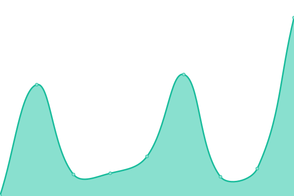
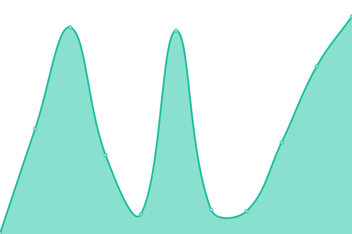
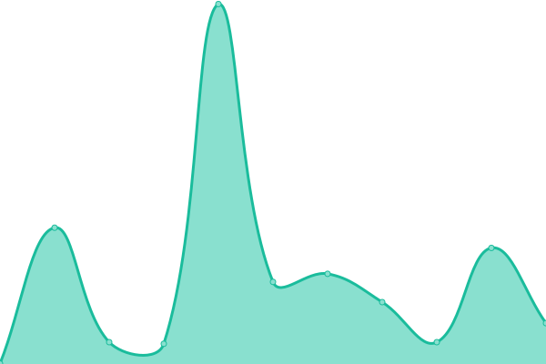
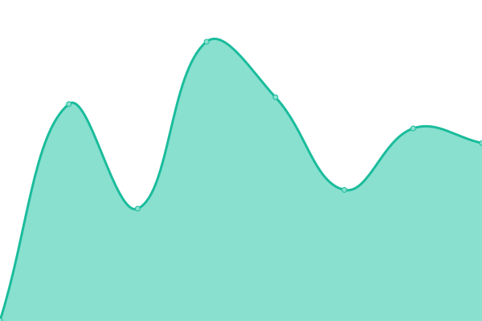
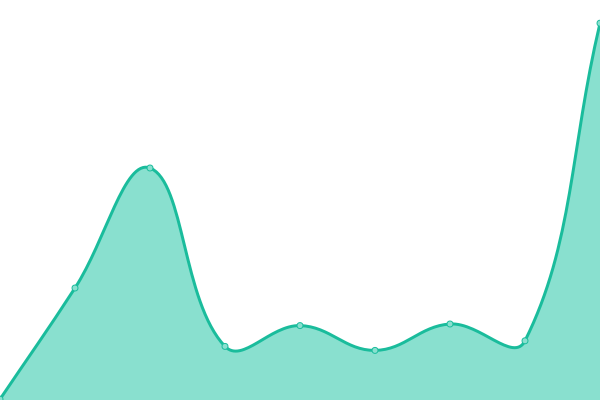
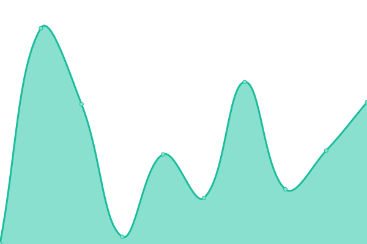

# [📈 Live Status](https://eaglercraftx1-8.github.io/eaglercraft-uptime): <!--live status--> **🟧 Partial outage**

This repository contains the open-source uptime monitor and status page for [EaglercraftX Client Collections](https://git.eaglercraft.win/EaglercraftX-Client-Collections), powered by [Upptime](https://github.com/upptime/upptime).

With [Upptime](https://upptime.js.org), you can get your own unlimited and free uptime monitor and status page, powered entirely by a GitHub repository. We use [Issues](https://github.com/eaglercraftx1-8/eaglercraft-uptime/issues) as incident reports, [Actions](https://github.com/eaglercraftx1-8/eaglercraft-uptime/actions) as uptime monitors, and [Pages](https://eaglercraftx1-8.github.io/eaglercraft-uptime) for the status page.

<!--start: status pages-->
<!-- This summary is generated by Upptime (https://github.com/upptime/upptime) -->
<!-- Do not edit this manually, your changes will be overwritten -->
<!-- prettier-ignore -->
| URL | Status | History | Response Time | Uptime |
| --- | ------ | ------- | ------------- | ------ |
|  [EaglercraftX Site Links](https://www.eaglercraft.win) | 🟩 Up | [eaglercraft-x-site-links.yml](https://github.com/eaglercraftx1-8/eaglercraft-uptime/commits/HEAD/history/eaglercraft-x-site-links.yml) | 

 167ms
     
 | 

<a href="https://eaglercraftx1-8.github.io/eaglercraft-uptime/history/eaglercraft-x-site-links">100.00%</a>
    

|  [Play (Netlify)](https://play.eaglercraft.win) | 🟥 Down | [play-netlify.yml](https://github.com/eaglercraftx1-8/eaglercraft-uptime/commits/HEAD/history/play-netlify.yml) | 

 151ms
     
 | 

<a href="https://eaglercraftx1-8.github.io/eaglercraft-uptime/history/play-netlify">49.53%</a>
    

|  [Fastest (Netlify)](https://fastest.eaglercraft.win) | 🟥 Down | [fastest-netlify.yml](https://github.com/eaglercraftx1-8/eaglercraft-uptime/commits/HEAD/history/fastest-netlify.yml) | 

 114ms
     
 | 

<a href="https://eaglercraftx1-8.github.io/eaglercraft-uptime/history/fastest-netlify">49.54%</a>
    

|  [Not Proxied Client (OnRender)](https://notproxiedclient.eaglercraft.win) | 🟩 Up | [not-proxied-client-on-render.yml](https://github.com/eaglercraftx1-8/eaglercraft-uptime/commits/HEAD/history/not-proxied-client-on-render.yml) | 

 355ms
     
 | 

<a href="https://eaglercraftx1-8.github.io/eaglercraft-uptime/history/not-proxied-client-on-render">100.00%</a>
    

|  [Client (Github Pages)](https://client.eaglercraft.win) | 🟩 Up | [client-github-pages.yml](https://github.com/eaglercraftx1-8/eaglercraft-uptime/commits/HEAD/history/client-github-pages.yml) | 

 148ms
     
 | 

<a href="https://eaglercraftx1-8.github.io/eaglercraft-uptime/history/client-github-pages">100.00%</a>
    

|  [Client2 (OnRender)](https://client2.eaglercraft.win) | 🟩 Up | [client2-on-render.yml](https://github.com/eaglercraftx1-8/eaglercraft-uptime/commits/HEAD/history/client2-on-render.yml) | 

 278ms
     
 | 

<a href="https://eaglercraftx1-8.github.io/eaglercraft-uptime/history/client2-on-render">100.00%</a>
    

|  [Client3 (Netlify)](https://client3.eaglercraft.win) | 🟥 Down | [client3-netlify.yml](https://github.com/eaglercraftx1-8/eaglercraft-uptime/commits/HEAD/history/client3-netlify.yml) | 

 129ms
     
 | 

<a href="https://eaglercraftx1-8.github.io/eaglercraft-uptime/history/client3-netlify">49.54%</a>
    

<!--end: status pages-->

[**Visit our status website →**](https://eaglercraftx1-8.github.io/eaglercraft-uptime)

## 📄 License

- Powered by: [Upptime](https://github.com/upptime/upptime)
- Code: [MIT](./LICENSE) © [Anand Chowdhary](https://anandchowdhary.com), supported by [Pabio](https://pabio.com)
- Data in the `./history` directory: [Open Database License](https://opendatacommons.org/licenses/odbl/1-0/)
